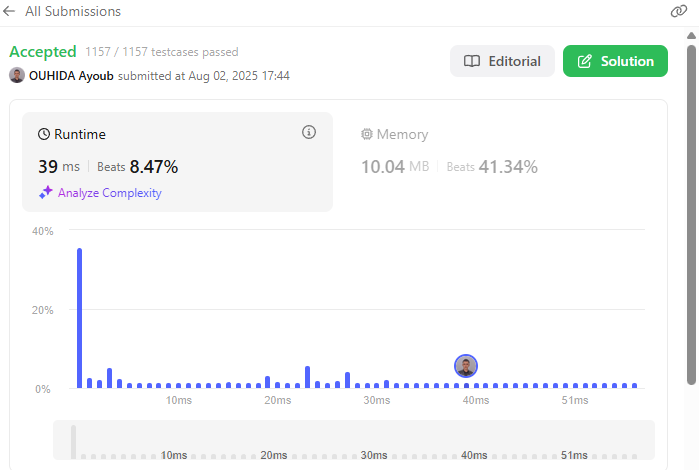
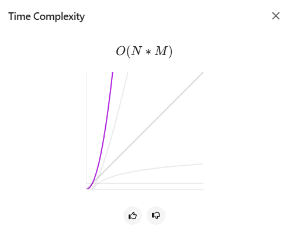
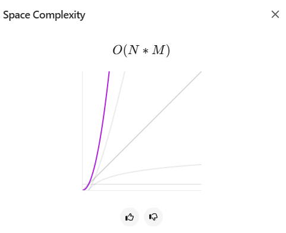

# Zigzag Conversion
Given a string `s` and an integer `numRows`, rearrange `s` into a zigzag pattern on `numRows` rows. The zigzag pattern means that the characters of `s` are placed in a zigzag form: first vertically down the rows, then diagonally up to the top, and repeating this process until all characters are placed. Finally, read the zigzag pattern row by row to form the converted string.

For instance, given s = "PAYPALISHIRING" with numRows = 3, the characters are placed as follows (in fixed-width font):

    P   A   H   N  
    A P L S I I G  
    Y   I   R  

Reading line by line gives the output "PAHNAPLSIIGYIR".

Example 1:
Input: s = "PAYPALISHIRING", numRows = 3  
Output: "PAHNAPLSIIGYIR"

Example 2:
Input: s = "PAYPALISHIRING", numRows = 4  
Output: "PINALSIGYAHRPI"  
Pattern:

    P     I    N  
    A   L S  I G  
    Y A   H R  
    P     I

Example 3:
Input: s = "A", numRows = 1  
Output: "A"

Constraints:
- 1 <= s.length <= 1000  
- s consists of English letters (lower‑case and upper‑case), ‘,’ and ‘.’  
- 1 <= numRows <= 1000

## LeetCode Submission Results

- ✅ Passed **1157 / 1157** test cases on LeetCode.
- ⏱️ Runtime: **39 ms** (Beats 8.47%)
- 💾 Memory: **10.04 MB** (Beats 41.34%)
- 📊 Verified Complexity: **O(N * M)** Time and **O(N * M)** Space.

<h2>LeetCode Final Analysis (Screenshots)</h2>

<table>
  <tr>
    <td></td>
    <td></td>
    <td></td>
  </tr>
</table>

## Personal Reaction & Feedback

✅ All 1157 / 1157 test cases passed – that part felt amazing.  
🔥 Hitting **41% on memory** actually made me proud because the 2D mapping approach isn’t lightweight, yet it handled it decently.  
😡 But **8% on runtime**? That hurt. I knew the algorithm was O(N * M), but seeing it that low on the leaderboard stings.  

This problem pushed me hard. Managing the 2D grid, row/column updates, and vertical/diagonal movement took a lot of debugging.  
I’m happy the logic is clean and correct, but I can’t lie – I’m walking away from this one both proud and a little pissed.  
Next step: revisit and try a more optimized approach without losing the mapping clarity I built here.